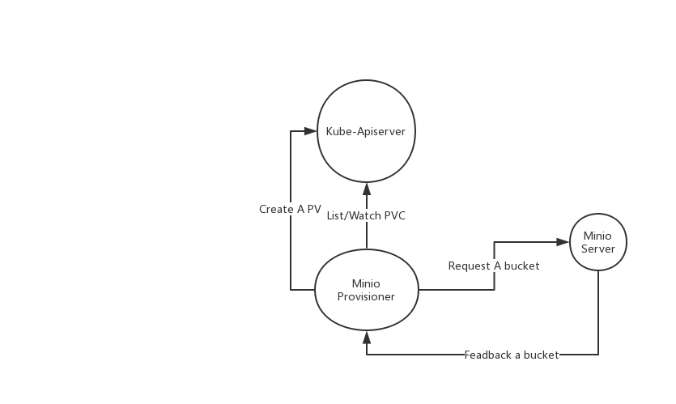

# minio-provisioner

minio-provisioner创建pv流程:

原生方案缺陷: bucket桶大小不能限制,不能限制bucket的访问流量.过于依赖s3fs fuse.
s3fs fuse所造成的问题是:   
Generally S3 cannot offer the same performance or semantics as a local file system. More specifically:
random writes or appends to files require rewriting the entire filemetadata operations such as listing 
directories have poor performance due to network latencyeventual consistency can temporarily yield stale 
data(Amazon S3 Data Consistency Model)no atomic renames of files or directoriesno coordination between multiple 
clients mounting the same bucketno hard linksinotify detects only local modifications, not external 
ones by other clients or tools